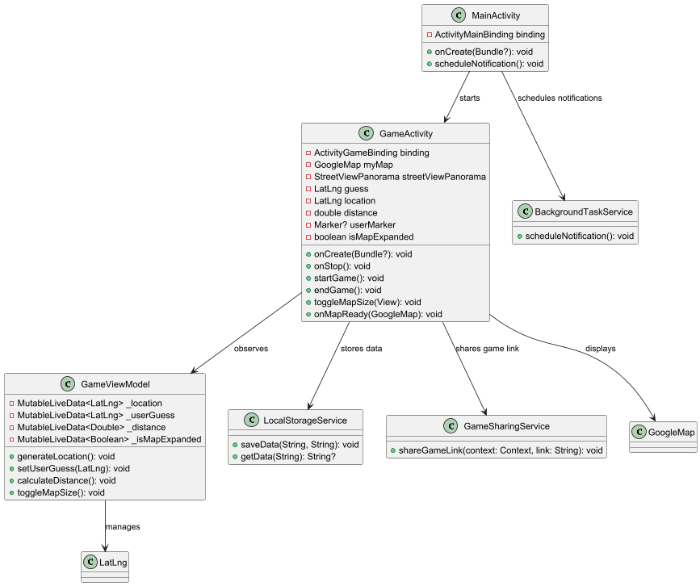

# Where In The World

## How to use this app

When launching the app the home screen appears.
On the Home screen you can see a history of your previous games showing the score, distance and when the game was played.
By clicking on the "Start game" button a new game is started on the game screen.
There you can see a street view of a location on the world.
The goal is to figure out where you are and set a marker of that location on the google map in the bottom left corner of the screen.

By clicking the green bottom in the bottom right of the google map you can end the game if you are certain about your guess, which takes you to the game overview.
In the game overview the distance between your guess and the actual location is displayed as well as your score. The score is calculated according to how close you were.

From there you can eiter navigate back to the home screen where your history refreshes or you can share the location of the game you just played with a fried.
For sharing the location click on share map and choose a messenger you want to send the link from.

If the recipient of the link has the app installed, a game with the shared location will start by pressing on the link.

## Linter

I used a .editorconfig file for my linting configurations and ran this via -> gradle -> formatting -> ktlintformat
The command to start the linter is : ./gradlew ktlintCheck

## Usage of ai

This app has been developed with the help of ChatGpt.
The Code ChatGpt generated was reviewed for understanding and adjusted for specific needs.

## Changes of implementation vs plan

## Plan

## Implementation

The classes i implemented aren't exactly the same as i planned them in my class diagram.
I need additional classes for the handling of displaying data in a recycler list, for the implementation of sending notifications to the user and storing data as shared preferences.
This is because i when planing the project i knew what i wanted to have but i didn't yet know how to implement these features which is why the change is class structure happend.

## Project Documentation

[Project Documentation](app/assets/WhereInTheWorld.pdf)

